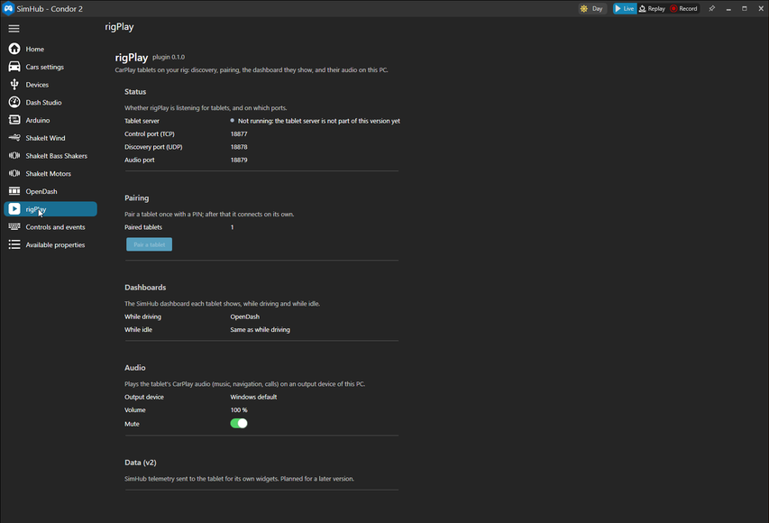
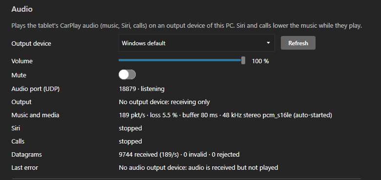

# rigPlay

rigPlay turns an Android tablet mounted on a sim-racing rig into a CarPlay screen for your iPhone, and
ties it to SimHub on the PC. The phone connects to the tablet wirelessly, CarPlay audio plays through
the PC's speakers or headset, a SimHub button on the tablet shows a SimHub dashboard, and wheel buttons
control music. When the PC is off, the phone is released.

How it works:

- **Tablet app.** An Android app (`io.xorob.rigplay`) that runs CarPlay. It joins your home network to
  talk to the PC and hosts its own Wi-Fi Direct group for the phone.
- **SimHub plugin.** A plugin with a rigPlay page in SimHub. It pairs the tablet with a PIN, chooses the
  dashboard the tablet shows, plays the tablet's CarPlay audio on a PC output device, and exposes
  now-playing properties and media actions to SimHub.
- **Phone.** An ordinary iPhone with CarPlay. It pairs with the tablet over Bluetooth and then connects
  over Wi-Fi Direct. It never talks to the PC.

## Status

Pre-release. Version 0.1.0 is in progress; see the [v1 milestone](https://github.com/xorob0/rigPlay/milestone/1)
for what is done and what is left. Some features described in these documents are not in the code yet.

Wireless CarPlay on a tablet that is also connected to home Wi-Fi has not been verified yet
([#33](https://github.com/xorob0/rigPlay/issues/33)). Wired USB is the fallback. See
[Compatibility](docs/COMPATIBILITY.md).

The APK on a [release](https://github.com/xorob0/rigPlay/releases) is signed and carries the experimental
accessory identity, so it connects to an iPhone; see [Accessory identity](docs/BUILD.md#accessory-identity-required-to-connect-to-an-iphone)
for what that identity is. APKs built for pull requests contain no identity and cannot connect.

## Install

1. Install the SimHub plugin on the PC: [plugin/INSTALL.md](plugin/INSTALL.md).
2. Turn on SimHub's web dash server (**Settings → Web dash server**, port 8888).
3. Install the rigPlay APK on the tablet and pair it with the PC using the PIN shown on the rigPlay page.
4. Pair the iPhone with the tablet over Bluetooth and tap **Connect phone**.

The full steps are in [docs/INSTALL.md](docs/INSTALL.md).

## Build

The Android app builds with the Gradle wrapper; the plugin builds with the .NET 8 SDK on any OS. See
[docs/BUILD.md](docs/BUILD.md).

```sh
./gradlew :shared:testDebugUnitTest :common:testDebugUnitTest :mobile:assembleDebug
dotnet build plugin/RigPlay -c Release
```

## Screenshots

The rigPlay page in SimHub:



The Audio section receiving audio:



Tablet screenshots (home screen, pairing, SimHub dashboard) will be added once those screens exist.

The project website is offline for v1. It will return with real screenshots.

## Documentation

- [Install and connect](docs/INSTALL.md)
- [SimHub plugin install](plugin/INSTALL.md)
- [Build from source](docs/BUILD.md)
- [Rig test checklist](docs/TESTING.md)
- [Compatibility](docs/COMPATIBILITY.md)
- [Wireless diagnostics](docs/WIRELESS_DIAGNOSTICS.md)
- [Privacy and diagnostic reports](docs/PRIVACY.md)
- [Security](SECURITY.md)
- [PC ↔ tablet protocol](docs/protocol.md)
- [Design decisions](docs/decisions/README.md)
- [SimHub plugin internals](plugin/README.md)
- [Contributing](CONTRIBUTING.md)
- [Changelog](CHANGELOG.md)
- [Credits and licences](docs/THIRD_PARTY_NOTICES.md)

## Source and credits

rigPlay is a fork of [DiPlay](https://github.com/shihabal3amri/DiPlay) by shihabal3amri. DiPlay is based on
[xcertplay](https://github.com/shilapi/xcertplay) by shilapi, licensed under GPL-3.0; the original README is
kept in [docs/UPSTREAM-README.md](docs/UPSTREAM-README.md). xcertplay credits [LIVI](https://github.com/f-io/LIVI)
and [Showcase](https://github.com/amineross/showcase) for protocol research.

The home and settings UI adapts [DiAuto](https://github.com/shihabal3amri/DiAuto) by shihabal3amri, licensed
under AGPL-3.0; that licence is in [docs/licenses](docs/licenses/DiAuto-AGPL-3.0.txt). Keep these notices when
you distribute modified versions.

CarPlay and the CarPlay icon belong to Apple Inc. rigPlay is an independent project; no affiliation with
or endorsement by Apple or SimHub is implied.

### Accessory identity

rigPlay is **not an Apple-certified product**. To connect to an iPhone, the app needs an accessory identity.
rigPlay uses the same experimental identity as DiPlay: a certificate and key recovered from public Carlinkit
firmware, not an MFi identity issued for rigPlay. It is not in this repository. An APK that bundles it
makes the private key extractable by anyone who has the APK. Whether iPhones keep accepting it after
future iOS updates, and whether it is suitable for general distribution, are unresolved. See
[docs/THIRD_PARTY_NOTICES.md](docs/THIRD_PARTY_NOTICES.md) and [SECURITY.md](SECURITY.md).

## Licence

GPL-3.0; see [LICENSE](LICENSE). The DiAuto-derived UI file is AGPL-3.0-only. Details are in
[docs/THIRD_PARTY_NOTICES.md](docs/THIRD_PARTY_NOTICES.md).
